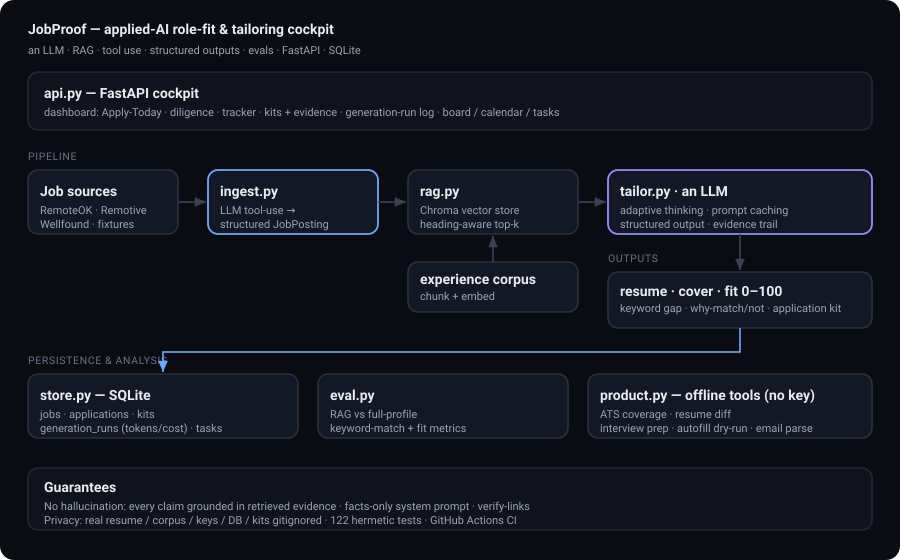
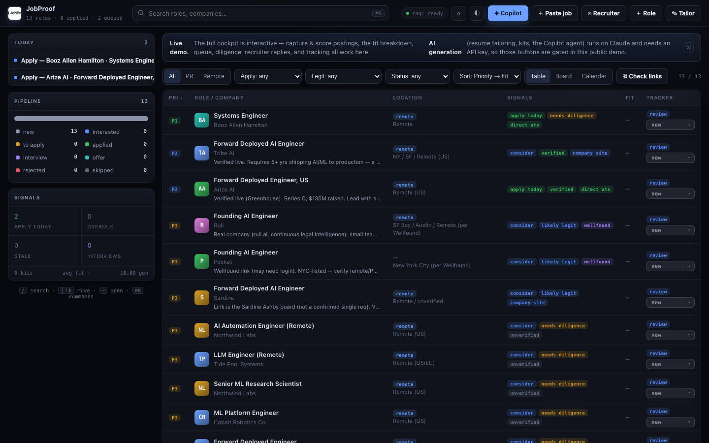
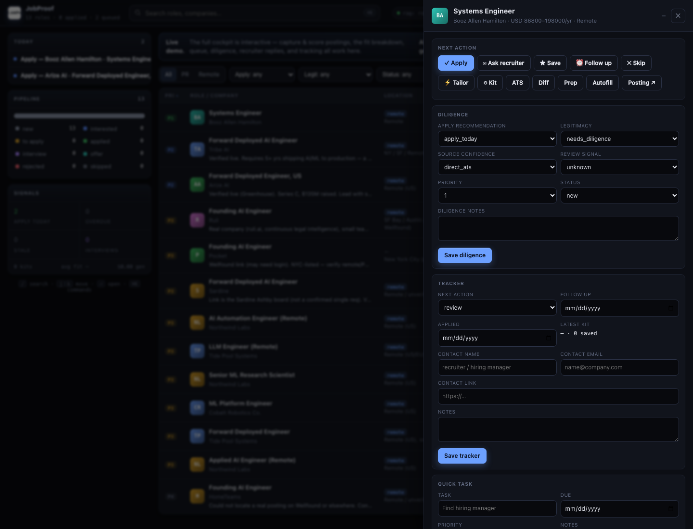

# JobProof

JobProof scores how well a job fits you and drafts a tailored resume and cover letter for you to
review before anything goes out. It pulls in postings, finds the most relevant parts of your
experience with RAG, scores the fit honestly (and tells you when to skip), and backs every claim
with a source. You review and submit. It never auto-applies.

[](https://jobproof-production.up.railway.app)
[](https://github.com/bitcoinbox/jobproof/actions/workflows/ci.yml)


**▶ Live demo: [jobproof-production.up.railway.app](https://jobproof-production.up.railway.app).** The
cockpit is fully interactive (capture, scoring, queue, tracking). The generation parts (tailoring,
kits, the Copilot agent) need an API key, so they're turned off in the public demo.

> **Runs out of the box on a fictional persona.** All committed sample data is invented;
> point it at your own gitignored corpus to use it for real. See [Privacy](#privacy).



### What's in it

- A real applied-AI surface: RAG over a vector DB, LLM tool use, structured outputs, prompt
  caching, and an eval suite that measures retrieval quality and faithfulness.
- It doesn't hallucinate: every generated claim points back to a source snippet, the system prompt
  is facts-only, and links are checked before they're shown.
- Production habits: SQLite persistence, per-run observability (tokens, cost, latency), a FastAPI
  cockpit, Docker, 140 tests, and GitHub Actions CI.
- Your data stays private: your real resume, corpus, keys, DB, and generated kits are gitignored.
  The public repo runs on a fictional persona.

### What this demonstrates (applied-AI engineering, end to end)

| Skill | Where it lives |
|---|---|
| **Agents** — tool-use loop, tool schemas, `tool_result` feedback, guardrails, inspectable trace | `src/agent.py` (Copilot) |
| **Hybrid RAG** — dense + BM25, fused with RRF, then MMR reranking | `src/rag.py` |
| **Tool use / function calling** — structured posting extraction | `src/ingest.py` |
| **Structured outputs** — validated Pydantic schemas, no string-parsing | `src/tailor.py`, `src/kit.py` |
| **Evals** — retrieval metrics (precision/recall/MRR), **LLM-as-judge faithfulness**, CI regression gate | `src/eval.py`, `src/judge.py` |
| **Deterministic NLP** — multi-dimension fit scoring + JSON-LD/heuristic capture (offline) | `src/scoring.py`, `src/capture.py` |
| **Backend & ops** — FastAPI, SQLite, observability, Docker, **140 hermetic tests**, CI | `src/api.py`, `src/store.py` |
| **Self-hostable** — runs on any OpenAI-compatible endpoint, not just Anthropic | `src/llm.py` |

### The cockpit



Open any role for the full decision view — fit breakdown, diligence, tracker, contacts, and
one-click next actions (apply / ask recruiter / save / follow up / skip):



---

## The problem

Applying to AI roles well is slow. For each posting you read it, decide if it's worth your time,
pull the right experience, and rewrite your resume to match its language without lying, then track
what happens. Spray-and-pray gets you rejected, and doing it by hand doesn't scale. JobProof is the
careful version, faster: it works out what's worth applying to and why, then drafts grounded
materials you review. It won't auto-submit. The goal is quality over volume.

## What it does

- Pulls remote postings from public job APIs (RemoteOK, Remotive) and parses each into a clean,
  typed record using LLM tool use (function calling).
- Finds the relevant parts of your experience with hybrid RAG: dense (vector) and BM25 keyword
  search over a local Chroma store, fused with Reciprocal Rank Fusion and MMR-reranked. So exact
  terms (TS/SCI, STIG, a cert) and semantic matches both show up, without duplicate chunks.
- Writes a one-page resume and cover letter, and returns an honest fit score (0–100) and the
  keyword gap as validated structured output.
- Tracks every job, score, and status in SQLite, and regenerates a tracker report.
- Keeps a history of generated kits, each saved with its evidence, output path, and copyable
  recruiter/cover/why-me text.
- Tracks the pipeline: per-job next action, applied date, follow-up date, notes, saved kit count,
  and overdue follow-ups.
- Records each generation run: token usage, cache reads and writes, latency, status, errors, and
  estimated cost.
- Measures itself: retrieval metrics (precision/recall/MRR) against labeled ground truth, an
  LLM-as-judge faithfulness score, and a CI regression gate.
- Serves a FastAPI web UI: paste a posting, get the tailored docs and score in the browser.

The system prompt keeps it honest: the model can only use facts from your experience, so it doesn't
invent anything, and whatever a job needs that you don't have shows up in `missing_keywords`
instead of being faked.

## Architecture

```
                 job posting (paste / URL / job API)
                                │
          ┌─────────────────────┼───────────────────────┐
          ▼                     ▼                         ▼
   ingest.py            (RemoteOK / Remotive)        api.py (FastAPI)
   LLM tool-use ─► structured JobPosting          + single-page UI
          │                                                │
          ▼                                                │
   store.py (SQLite) ◄──────────── applications ───────────┤
          ▲                                                ▼
   rag.py (Chroma, local embeddings) ─ retrieved experience ─┐
          ▲                                                  ▼
   experience corpus ─► chunk + embed              tailor.py ─ an LLM
                                                   (adaptive thinking · prompt
                                                    caching · structured output)
                                                            │
                                                            ▼
                              resume.md · cover-letter.md · fit score · keyword gap
                                                            │
                                          eval.py ─► retrieval metrics · faithfulness judge · CI gate
```

## Quickstart

```bash
python -m venv .venv && source .venv/bin/activate
pip install -r requirements.txt

# ── 30-second tour, NO API key ──────────────────────────────
python -m src.cli demo      # seed the cockpit with sample jobs (offline)
python -m src.cli serve     # → http://127.0.0.1:8000 (a fully populated dashboard)
# ────────────────────────────────────────────────────────────

cp .env.example .env          # add your ANTHROPIC_API_KEY for tailoring / kits

# 1. Build the retrieval index from the sample persona
python -m src.cli index sample-corpus/

# 2. Tailor to one posting (RAG mode)
python -m src.cli jobs/applied-ai-engineer-remote.txt --rag

# 3. Or run the whole pipeline against offline sample postings
python -m src.cli run --source fixture --query "ai engineer" --rag

# 4. Launch the web UI
python -m src.cli serve        # http://127.0.0.1:8000
```

Everything except tailoring runs **with no API key** (offline fixtures + a deterministic
test path), so you can explore ingestion, the store, and the UI before adding a key.

## The capabilities, one command each

| Command | What it does |
|---|---|
| `python -m src.cli index sample-corpus/` | Build the RAG index from an experience corpus |
| `python -m src.cli <job.txt> --rag` | Tailor to one posting (or a folder), ranked by fit |
| `python -m src.cli ingest --source remotive --query "llm" --limit 5` | Fetch + parse real postings into SQLite |
| `python -m src.cli ingest --source greenhouse --board stripe --query "ai"` | Pull a company's ATS board (Greenhouse / Lever / Ashby / HN) |
| `python -m src.cli import-targets` | Import startup target roles (Wellfound) from a fixture — idempotent |
| `python -m src.cli run --source remoteok --query "llm" --rag` | Full pipeline → outputs + tracker |
| `python -m src.cli kit --job-id 3 --pdf` | Generate a full application kit (+ upload-ready resume PDF) |
| `python -m src.cli capture --file saved-page.html` | Capture a job from saved HTML / pasted text: extract, score, track |
| `python -m src.cli check-links` | Verify posting URLs; flag dead ones so they drop from the queue |
| `python -m src.cli eval --dataset evals/labeled.jsonl -k 12` | Measure RAG vs full-profile |
| `python -m src.cli report --set 3=applied` | Advance an application's status |
| `python -m src.cli report --digest` | Weekly ops digest: pipeline movement, source funnel, gen cost |
| `POST /api/agent` (Copilot) | A tool-using agent answers over your pipeline (search jobs, score, search experience) |
| `python -m src.cli serve` | FastAPI web UI / cockpit dashboard |

Use offline sample data anywhere with `--source fixture --no-parse`.

### Ingestion sources

Keyword search across **RemoteOK** and **Remotive**, plus per-company **ATS boards** — Greenhouse,
Lever, and Ashby (`--board <company-token>`) — and **Hacker News "Who is hiring?"** threads
(`--source hn --board <story-id>`). ATS boards are clean public JSON (no scraping, no ToS risk) and
land pre-tagged `source_confidence=direct_ats`. Capture anything else from the browser with the
**one-click bookmarklet** at `/capture`, or paste it into the cockpit's "Add role" modal.

### Self-hosted inference (run it on your own metal)

Tailoring and kit generation default to the Anthropic API, but point them at **any
OpenAI-compatible endpoint** (vLLM, Ollama, LM Studio, TGI) and JobProof runs fully self-hosted —
zero marginal cost, nothing leaving your network:

```bash
export AUTO_APPLY_LLM_BACKEND=local
export AUTO_APPLY_LLM_BASE_URL=http://your-cluster.local:8000/v1
export AUTO_APPLY_LLM_MODEL=llama-3.3-70b-instruct
python -m src.cli serve     # /healthz now reports backend=local
```

The backend is a small adapter shaped like the Anthropic client, so the tailoring core is
unchanged — structured outputs are validated against the same Pydantic schemas either way.

### Link verification (no dead postings)

`check-links` (and the cockpit's **Check links** button / `POST /api/check-links`) fetches every
stored posting's URL behind an SSRF guard and classifies it: `404/410 → dead`, `2xx/3xx → alive`,
ambiguous (`403/429/5xx/timeout`) → `unknown`. Dead postings get a badge, a timeline event, and are
**dropped from the action queue** — the system enforces the rule "never surface a job whose link is dead."

## Universal job capture (Dice / ClearanceJobs / LinkedIn / anywhere)

Login-gated boards can't be scraped reliably, so capture is **user-driven and credential-free**:
paste the posting text, or save the page (Cmd-S) and import the `.html`. Either way JobProof
extracts the same clean fields — title, company, location, **remote/hybrid/onsite/field**,
**clearance + polygraph**, salary range, job id, **required vs preferred skills**, years of
experience, degree, certifications, posted date, full description — with an extraction
**confidence** (low-confidence captures are flagged *needs review* and stay editable), and the
**raw input preserved for audit**.

Extraction is layered, most-robust first — *no brittle DOM/selector scraping*:

1. **schema.org `JobPosting` JSON-LD** — embedded by ClearanceJobs, Dice, LinkedIn, and most ATS
   pages for SEO. Stable and structured.
2. **OpenGraph / `<meta>` tags** when JSON-LD is absent.
3. **Heuristic text parser** for plain-text pastes (title / "at Company" / clearance / work-mode /
   salary / job-id regexes).

Then a **deterministic, offline fit breakdown** (no model, no network) answers "is this worth it?"
across seven dimensions and tells you which resume to send and what to do next:

- `skill_match` · `clearance_match` · `salary_fit` · `remote_fit` · `seniority_fit` · `passion_fit`
  · `risk_score`/`risk_flags`, with **matched vs missing requirements** and an explicit
  **why-apply** and **why-this-might-be-beneath-you / risky**.
- An **apply recommendation**: `apply` · `ask_recruiter` (decent role, comp not stated) · `maybe` · `skip`.
- A **defense/cleared preset** boosts TS/SCI, remote/hybrid, systems/network engineering,
  VPN/firewalls, Python/Bash, STIG/RMF, DevSecOps, and AI/backend; it penalizes help-desk /
  desktop-support / field-tech titles, sub-floor salary, and heavy onsite/travel.
- **Resume recommendation** picks one of *Cleared Defense AI · AI Software · Applied AI ·
  AI Automation · ATS Plain* with a reason, an alternate, and warnings (e.g. defense contractors —
  Booz Allen, Leidos, SAIC… — route to Cleared Defense AI).

All of your preferences live in **`src/profile.py`** — salary floors, remote/seniority rules,
skill priorities, the defense-contractor list — so you can tune scoring without touching logic.

### Recruiter replies

Paste a recruiter's message and JobProof extracts the **name / company / email / phone / role**
and drafts a short reply in a plain, human voice (not corporate, not over-AI) for your chosen
**intent** (interested / ask salary / ask remote / ask timeline / follow up / decline) and **tone**
(concise / warm / direct). Attaching it to a job logs the thread and creates the follow-up task.

### Copilot (tool-using agent)

Ask in plain language — *"which cleared remote roles should I prioritize today, and why?"* — and a
**tool-using agent** answers over your real pipeline. It's the canonical agent loop, not a single
call: the model chooses tools (`search_jobs`, `get_job`, `score_job_text`, `search_experience`),
JobProof executes them against the store / scorer / hybrid-RAG, feeds results back, and loops
(bounded by a step cap) until it answers. Every tool call is shown in an **inspectable trace**, so
you see exactly how it reasoned — and it's grounded in your data, so it can't invent jobs or scores.

### One-click decisions

Every captured job gets next-action buttons — **Apply · Ask recruiter · Save · Follow up · Skip** —
that update status, next action, and tasks in one move.

In the dashboard: **Paste job** / **Import saved HTML** / **Quick score only** show the extracted
fields, the score breakdown, an apply / maybe / skip call, and the resume to upload — before you
commit anything. From the CLI: `python -m src.cli capture --file booz-allen.html` (add
`--score-only` to triage without saving).

## Job-search cockpit (Apply Today)

The dashboard is a decision system, not just a tracker. It answers *"what should I apply to
today, why, and what kit should I use?"*

- **Action queue** — the dashboard leads with a prioritized "Today" rail: overdue follow-ups,
  follow-ups and tasks due today, interviews to prep, apply-today roles not yet applied, and
  leads going stale (10+ days without activity). Follow-ups complete or snooze with one click.
- **Pipeline funnel** — a status-distribution bar whose legend doubles as a filter; plus a
  command palette (⌘K) to jump to any role, and full keyboard navigation (`j`/`k`/`⏎`).
- **Diligence fields per job** — `legitimacy_status` (verified / likely_legit / needs_diligence /
  skip), `review_signal`, `source_confidence` (direct_ats / company_site / wellfound / job_board /
  unverified), `priority` (1–5), and `apply_recommendation` (apply_today / consider / wait / skip),
  plus free-text `diligence_notes`. Edit them inline in the detail drawer.
- **Apply Today view** — filter by apply-recommendation and legitimacy, sort by priority then fit,
  with compact diligence badges and a one-line "why" on every row.
- **Application tracker** — each job has `next_action`, `applied_at`, `follow_up_at`, recruiter
  contact (name / email / link), and notes. Setting a job to `applied` automatically schedules a
  7-day follow-up; every status change, tailoring, kit, and sent follow-up lands on a per-job
  activity timeline.
- **Persistent kit history** — generated kits are saved to SQLite and `out/kits/`, then shown in
  the drawer with one-click copy controls for recruiter DM, why-me bullets, and cover letter.
- **Generation run log** — each tailoring/kit call stores status, latency, tokens, estimated cost,
  model, mode, and any error. The header summarizes total generation runs and cost.
- **Fit explanation** — tailoring stores `why_match`, `why_not`, `missing_proof`,
  `keywords_to_mirror`, and a `recruiter_angle`, shown in the drawer and on the tailor page.
- **Evidence map (no-hallucination view)** — every generated claim is paired with the experience
  snippet + source that supports it, so you can verify before you apply.

Import the current startup targets and open the cockpit:

```bash
python -m src.cli import-targets          # Pocket, HomeTeams, Sardine, Ruli, Arize AI, tribe.ai
python -m src.cli serve                   # http://127.0.0.1:8000
```

Edit `fixtures/startup-targets.sample.json` to add your own targets (it carries the diligence
fields). URLs/salary are left `null` where unknown — verify before applying.

## Application kits

Generate a complete, review-ready kit for a job — tailored resume, cover letter, a 5-bullet
"why me", a recruiter DM, interview-story prompts, and an **evidence map**:

```bash
python -m src.cli kit --job-id 3          # a job in your store
python -m src.cli kit --job jobs/some-role.txt
```

Kits are written to `out/kits/<company-slug>-<job-id>/` (resume.md, cover-letter.md, why-me.md,
recruiter-dm.md, interview-stories.md, evidence-map.md, kit.json). You can also generate one from
the dashboard drawer ("⚙ Generate kit"). Generation needs `ANTHROPIC_API_KEY`.

Every kit is also persisted in SQLite, so the dashboard can show kit history after refresh:

```bash
curl http://127.0.0.1:8000/api/jobs/3/kits
curl http://127.0.0.1:8000/api/jobs/3/kit/latest
curl http://127.0.0.1:8000/api/generation-runs
```

## Evaluation

RAG quality has two halves, and JobProof measures both, then gates CI on them.

**1. Retrieval quality (deterministic, no API key).** Each labeled job says which corpus sources
actually demonstrate it (`relevant_sources` in `evals/labeled.jsonl`). The eval retrieves and scores
the standard information-retrieval metrics against that ground truth:

```
python -m src.cli eval --retrieval-only        # free, no key; this is what CI runs

query                      | mrr   | precision@5 | recall@5
applied-ai-engineer        | 1.000 |   0.600     |  0.600
ml-platform-engineer       | 1.000 |   0.600     |  1.000
MEAN                       | 1.000 |   0.450     |  0.817
```

These are honest numbers, not a vanity pass. They show recall climbing from k=3 to k=5 and
precision low enough that a reranker would help. The eval tells you what to fix. (Fictional sample
corpus.)

**2. Generation faithfulness (LLM-as-judge).** Does the tailored resume only claim what the evidence
supports? `src/judge.py` breaks the resume into individual claims and judges each one against the
retrieved evidence using forced structured output, then scores `supported / total`. I validated it
adversarially: plant a fake "VP of Engineering" or "PhD" and it flags them. So a high score actually
means something. This is what backs the no-fabrication promise.

```
python -m src.cli eval --faithfulness          # adds a grounding score per job
```

**3. Regression gate (CI).** `python -m src.cli eval --gate` exits 1 if a mean metric drops below
its floor in `evals/thresholds.json`. A CI job runs the retrieval gate on every push, so retrieval
quality can't quietly get worse without failing the build.

The metric math is pure and unit-tested (`tests/test_eval.py`, `tests/test_judge.py`), and the judge
is mockable through the `client=` seam, so the whole eval runs without a network or a key.

## How the AI engineering works

- **Model:** `claude-opus-4-8` with `thinking: {"type": "adaptive"}` — the model decides how
  much to reason per posting. No `temperature`/`budget_tokens` (removed on 4.8).
- **Structured outputs:** `client.messages.parse(..., output_format=TailoredApplication)`
  returns a validated Pydantic object — score and keywords come back typed, no JSON fishing.
- **Tool use / function calling:** ingestion forces a `record_job_posting` tool call to turn
  messy postings into typed records. (Forced tool use ⇒ thinking disabled for that call.)
- **RAG:** heading-aware chunking + overlap → local Chroma embeddings → top-k retrieval.
  Pluggable to Voyage AI or pgvector via a single `embedding_function` seam.
- **Prompt caching:** the full-profile path caches a stable prefix and reuses it across a
  batch. The **tradeoff** (good interview material): RAG's per-job context gives that cache
  up for a smaller, sharper prompt — use RAG when the corpus outgrows one page.
- **Workflow vs. agent:** the pipeline is a deterministic workflow; the LLM is used only
  where judgement is needed (parsing, tailoring). The right altitude for the task.

## Tech stack

Python · Anthropic API (`anthropic`) · Chroma (vector DB) · FastAPI · SQLite · httpx ·
Pydantic · Docker · pytest · ruff · GitHub Actions.

## Run the tests

```bash
pip install -r requirements-dev.txt
./.venv/bin/python -m pytest -m "not embeddings"   # hermetic: no network, no API key
```

Covers the SQLite migrations (diligence + fit-explanation columns), the dashboard API fields,
idempotent target import, fit-explanation serialization, and application-kit generation +
gitignored output path — all with the LLM and embeddings mocked.

## Deploy

```bash
docker build -t jobproof .
# CLI:
docker run -e ANTHROPIC_API_KEY=$ANTHROPIC_API_KEY -v "$PWD/out:/app/out" jobproof run --source fixture
# Web UI (override the entrypoint):
docker run -e ANTHROPIC_API_KEY=$ANTHROPIC_API_KEY -p 8000:8000 --entrypoint python \
  jobproof -m uvicorn src.api:app --host 0.0.0.0 --port 8000
```

On Railway/Render/Fly: deploy the image, set `ANTHROPIC_API_KEY`, run `uvicorn src.api:app`.
The URL-input route is **off by default** (SSRF-safe); enable with `AUTO_APPLY_ALLOW_URL=1`.

## What I learned

- "Facts only" in the system prompt is what makes an LLM resume tool trustworthy.
- Prompt-cache economics are real, and one silent cache invalidation quietly doubles the bill.
- RAG is a tradeoff, not a default. You need an eval to know when it actually helps.
- Evals are the difference between knowing the system works and hoping it does.

## Roadmap

Hosted embeddings (Voyage) · pgvector on Railway · auth on the web UI · streaming the
generation in the browser · more job sources.

## Privacy

All committed sample data is a **fictional persona** ("Robin Vega") so the project runs and
demos without exposing anyone. Your real resume (`master-resume.md`), experience corpus
(`experience/`), API key (`.env`), generated outputs (`out/`, including application kits under
`out/kits/`), index (`.chroma/`), and the SQLite store (`*.db`) are all **gitignored** — they
never leave your machine. Generated application kits contain your real, tailored materials, so
they stay local by design; nothing in the tailoring path transmits your resume anywhere except
the Anthropic API call you invoke.

## License

MIT — see [LICENSE](LICENSE).
